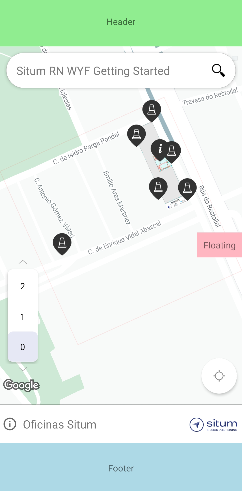

<p align="center">  <h1 align="center">Situm React Native Wayfinding Getting Started</h1> </p>

<p align="center" style="text-align:center">

A module for React Native using the [Situm](https://www.situm.com/) Wayfinding to show a building and positioning indoors.

</p>

<div align="center" style="text-align:center">

[](https://opensource.org/licenses/MIT)


[](https://github.com/ellerbrock/typescript-badges/)

</div>

## Table of contents

  

1. [Introduction](#introduction)

2. [Setup](#setup)

3. [Run Android version](#run-android-version)

4. [Run iOS version](#run-ios-version)

5. [Submitting Contributions](#submitting-contributions)

6. [License](#license)

7. [More information](#more-information)

8. [Support information](#support-information)
  

# Introduction

  

Situm Wayfinding Module has been designed to create indoor location applications in the simplest way. It has been built in the top of the Situm SDK. If you are interested in building applications using the Situm SDK, please refer to [Situm React Native SDK Sample app](https://github.com/situmtech/situm-react-native-getting-started).

With the sample app you will be able to:

1. Load a Google Map with a selected Situm building and start the positioning using the MapView object.

2. Set listeners to receive notifications about user locations, buildings, POIs and routes.

When you run the app you will see different components: the header, the footer, the floating window and the component with the Situm WYF module in the middle.

| Layout | Alert | Navigation |
|-------------|-----------------|-----------------|
|             |                 |  |

# Requirements

## Set up the Situm Account

Before running this application you must set up an account in the [Situm Dashboard](https://dashboard.situm.com), configure a building and retrieve a Situm API Key.

1. Go to the [sign in form](https://dashboard.situm.com) and enter your username and password to sign in.
2. Once you log in, go to the [account configuration](https://dashboard.situm.com/accounts/profile) and on the API Key section click on 'Generate new API Key'.
3. Go to the [buildings section](https://dashboard.situm.com/buildings) and create a building.
4. Download [Situm Mapping Tool](https://play.google.com/store/apps/details?id=es.situm.maps&hl=es&gl=US) in Play Store (only Android devices) and calibrate your building. Check the [user guide](https://situm.com/docs/03-calibration/) for detailed information.
5. Check this [guide](https://developers.google.com/maps/documentation/android-sdk/get-api-key) to get your own Google API Key.
6. Retrieve the ID of your selected building. You will find it in the link of the Situm Dashboard.

# Setup

## Step 0: install React Native

This getting started needs React Native in order to properly work. To set up React Native please refer to the **React Native CLI Quickstart** [documentation](https://reactnative.dev/docs/environment-setup). Getting Started uses React Native ```version 0.69.5``` or higher.
  

## Step 1: install dependencies

You need to install the [@situm/react-native-wayfinding](https://www.npmjs.com/package/@situm/react-native-wayfinding). In the root directory you will need to execute the following code:


```
$ npm install
```

This will download all the requested dependencies in the package.json.

### iOS only

Go to the `/ios` folder and run the following code:
```
$ pod install
```
This will download the correct pods to run the application in iOS.


## Step 2: configure the project

### Android
You will need to add to the `manifest.xml` the following code:
```
<?xml ...>
<manifest ...>
  <application
  ...>

    <meta-data
        android:name="com.google.android.geo.API_KEY"
        android:value="GOOGLE_API_KEY_HERE" />

    ...
    <activity ...></activity>
  </application>
</manifest>
```

The Situm React Native Wayfinding Getting Started depends on the Situm Wayfinding for Android visual component. Keep in mind that, for new projects, the Situm repository must be added to the `build.gradle` file to resolve the dependency:
```
allprojects {
    repositories {
        maven { url "https://repo.situm.com/artifactory/libs-release-local" }
        ...
```


### iOS
Some permissions are requested to use the Wayfinding. Add the following permissions in the `config.plis`.
- NSLocationAlwaysAndWhenInUsageDescription.
- NSBluetoothAlwaysUsageDescription.

## Step 3: setup the credentials
In the config.js file under the `./app/src` folder, change the following code with your own Situm credentials.
```
export  const  SITUM_USER = 'SITUM_USER_HERE';
export  const  SITUM_API_KEY = 'SITUM_API_KEY_HERE';
export  const  BUILDING_ID = 'SITUM_BUILDING_ID_HERE';
export  const  GOOGLE_API_KEY = 'GOOGLE_API_KEY_HERE';
```

## Run Android version

-   **Run from command line:**  `$ npx react-native run-android`. If it doesn't open a Metro terminal, just execute `$ npx react-native start` before the other command.
-   **Run from Android Studio:**  Open  `root/android`  folder in Android Studio and run project. It is possible that you will have to execute `$ npx react-native start` to start the metro terminal. If you are using a physical device, use `$ adb reverse tcp:8081 tcp:8081` to configure the ports correctly so that metro is connected to that device.

## Run iOS version

-   **Run from command line:**  `$ npx react-native run-ios`. Again, if it doesn't open a Metro terminal, just execute `$ npx react-native start` before the other command.
-   **Run from XCode:**  Go to  `root/ios`  folder and open  `.xcworkspace`, then run the project.

## Submitting Contributions

You will need to sign a Contributor License Agreement (CLA) before making a submission. [Learn more here.](https://situm.com/contributions/)

## License

This project is licensed under the MIT - see the [LICENSE](LICENSE) file for details.

## More information

More info is available at our [Developers Page](http://developers.situm.es).

## Support information

For any question or bug report, please send an email to <support@situm.es>.